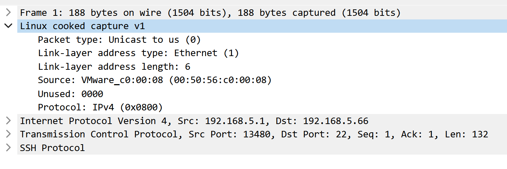

# xxpdump-rs

The classic packet capture software `tcpdump` is outdated.

My reasons are as follows:

* it does not support remote capture
* it does not support the management of local historical files
* it does not support automatic file upload to the server
* and more...

## libpcap

Why not use libpcap to capture packets?

When capturing from the "any" device, or from one of those other devices, in Linux, the libpcap doesn't supply the link-layer header for the real "hardware protocol" like Ethernet, but instead supplies a fake link-layer header for this pseudo-protocol. The [reference 1](https://wiki.wireshark.org/SLL) and [reference 2](https://stackoverflow.com/questions/51358018/linux-cooked-capture-in-packets).

I have tried running the software from root, but the pseudo header still exists, so I gave up using the pcap library and turned to writing my [own](https://github.com/rikonaka/pcapture-rs).

